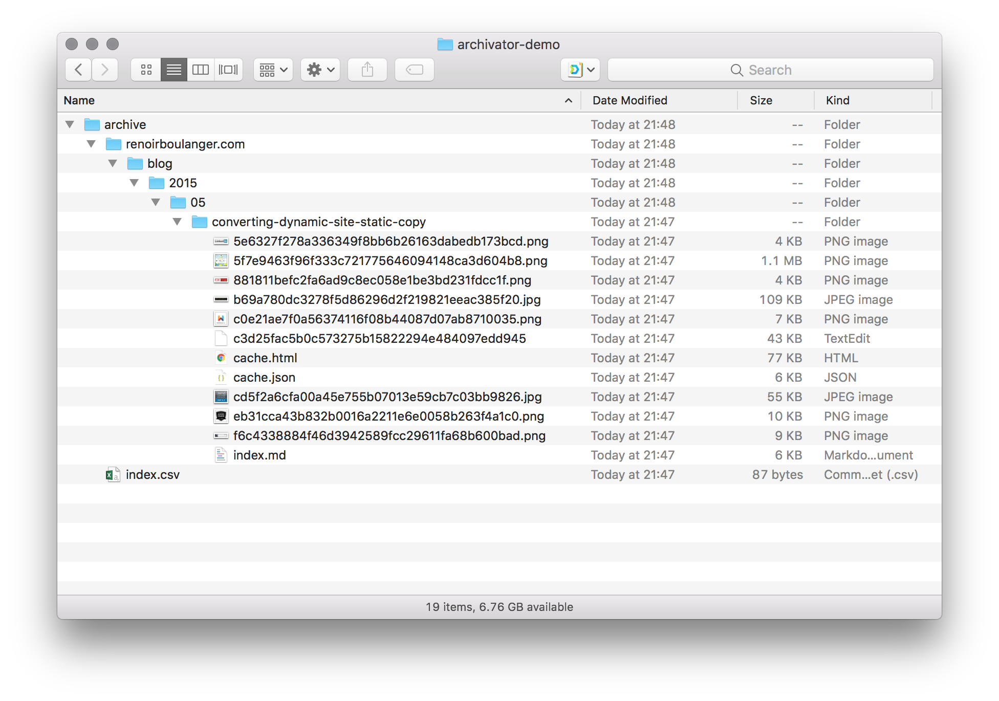
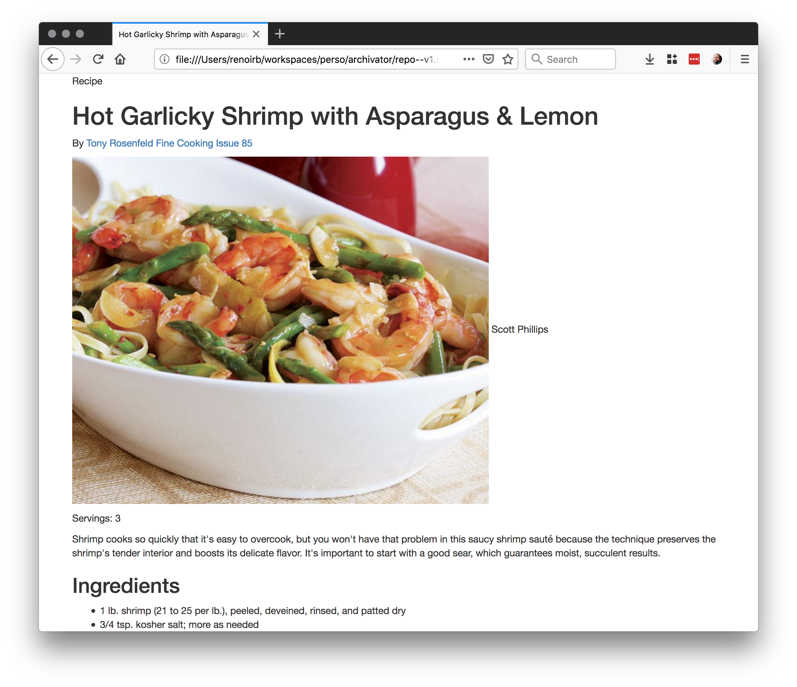

# Make your Archivator archive a static site

This is an example of how you could list sites you want to archive
and describe how you want them to look locally leveraging [renoirb/archivator](https://github.com/renoirb/archivator) [](https://www.npmjs.com/package/archivator).

## Use

### Archive pages only

If you already have Node.js v10+ installed already with `npx`, you can do the following

1. Create an empty folder, with a `archive/` directory folder into it

   ```console
   mkdir -p archivator-demo/archive
   ```

1. Add at least one recipe into `archive/index.csv`

   ```console
   echo 'https://renoirboulanger.com/blog/2015/05/converting-dynamic-site-static-copy/;article;' > archivator-demo/archive/index.csv
   ```

1. From the folder where the `archive/` folder exists (i.e. where you'd put your site, `package.json`, etc.), run archivator using `npx`

   ```console
   cd archivator-demo
   npx archivator@^1.0.2
   ```

1. Have a look at all the directories created and copies of the pages

   

### As a project to make archived content be presented in static-site generator

1. Clone this repo, or fork it

   ```console
   git clone https://github.com/renoirb/archivator-demo.git cookbook
   cd cookbook
   yarn
   ```

1. Add an URL to a recipe you like to [`archive/index.csv`](./archive/index.csv)

   Files goes as the following: `<URL>;<CSS selector of the main section of interest>;<CSS selectors of things you do not want>`

   ```csv
   https://www.finecooking.com/recipe/hot-garlicky-shrimp-with-asparagus-lemon;div.recipe__wrap;.recipe__top__content--secondary
   ```

1. Archive the recipes

   Which should write a copy of the page in `archive/finecooking.com/recipe/hot-garlicky-shrimp-with-asparagus/`,
   copy all images to it, and create a simplified version `index.md` in Markdown format.

   ```console
   yarn archive
   ```

1. Make the archived URLs into HTML

   You can give it the look you want by changing `layouts/default.hbs`. It's just a rough starting point.
   Take a look at the awesome [Metalsmith](http://www.metalsmith.io/) project.

   ```console
   yarn build
   ```

   Which will read all `archive/**/index.md` into respective `dist/**/index.html`

1. Consult them or expose them on the Web. They're in `dist/`

   So, now you have your own web cookbook locally.

   


1. If you use GitHub pages (see [Using GitHub pages and Jekyll](#using-github-pages-and-jekyll) below), see [renoirb.github.io/archive/finecooking.com/recipe/hot-garlicky-shrimp-with-asparagus/](https://renoirb.github.io/archivator-demo/archive/finecooking.com/recipe/hot-garlicky-shrimp-with-asparagus/)


### Using GitHub pages and Jekyll

1. Reproduce [`_config.yml`](./_config.yml)

1. Commit files from `archive/<Normalized URL as a path>/index.md`

1. See the following copy;

   - **[renoirb.github.io/archivator-demo/archive/renoirboulanger.com/blog/2015/05/converting-dynamic-site-static-copy/](https://renoirb.github.io/archivator-demo/archive/renoirboulanger.com/blog/2015/05/converting-dynamic-site-static-copy/)** (<small>[source](./archive/renoirboulanger.com/blog/2015/05/converting-dynamic-site-static-copy/index.md)</small>)
   - **[renoirb.github.io/archive/finecooking.com/recipe/hot-garlicky-shrimp-with-asparagus/](https://renoirb.github.io/archivator-demo/archive/finecooking.com/recipe/hot-garlicky-shrimp-with-asparagus)** (<small>[source](./archive/finecooking.com/recipe/hot-garlicky-shrimp-with-asparagus/index.md)</small>)
   - **[renoirb.github.io/archivator-demo/archive/yupitsvegan.com/caramelized-onion-hummus](https://renoirb.github.io/archivator-demo/archive/yupitsvegan.com/caramelized-onion-hummus/)** (<small>[source](./archive/yupitsvegan.com/caramelized-onion-hummus/index.md)</small>)

1. ... you’re on your own. Ruby is hard (for a Non Ruby developer as myself). I haven't successfully made this work yet, I’ll update this soon.


## Next up

Since this project is just about binding Archivator and a Static HTML site.

As such, you may want to take a look at [renoirb/archivator](https://github.com/renoirb/archivator)
where there will be other features than exporting into Markdown and then HTML.

Other _Archivator_ features should include indexing content to ElasticSearch.

