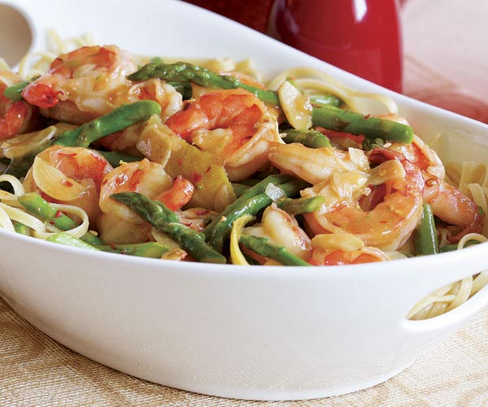

# Hot Garlicky Shrimp with Asparagus & Lemon 

By [Tony Rosenfeld][0] [Fine Cooking Issue 85][1] 

 Scott Phillips 

Servings: 3 

Shrimp cooks so quickly that it's easy to overcook, but you won't have that problem in this saucy shrimp sauté because the technique preserves the shrimp's tender interior and boosts its delicate flavor. It's important to start with a good sear, which guarantees moist, succulent results. 

## Ingredients 

* 1 lb. shrimp (21 to 25 per lb.), peeled, deveined, rinsed, and patted dry 
* 3/4 tsp. kosher salt; more as needed 
* Freshly ground black pepper 
* 1 lemon 
* 6 Tbs. extra-virgin olive oil 
* 4 medium cloves garlic, thinly sliced 
* 3/4 lb. asparagus, bottoms snapped off, halved lengthwise if thick, and cut into 2-inch lengths (2 cups) 
* 1/8 to 1/4 tsp. crushed red pepper flakes 
* 2/3 cup low-salt chicken broth 
* 1/2 tsp. cornstarch 

## Nutritional Information 

* Calories (kcal) : 380
* Fat Calories (kcal): 250
* Fat (g): 29
* Saturated Fat (g): 4
* Polyunsaturated Fat (g): 3.5
* Monounsaturated Fat (g): 20
* Cholesterol (mg): 225
* Sodium (mg): 560
* Carbohydrates (g): 6
* Fiber (g): 1
* Protein (g): 27 

## Preparation 

* Sprinkle the shrimp with a scant 1/4 tsp. salt and a few generous grinds of black pepper. Using a peeler, gently shave the zest in strips from the lemon, taking care not to get any of the bitter white pith. Squeeze the lemon to get 1 Tbs. juice. 

Put a 12-inch skillet (not nonstick) over medium-high heat for 1-1/2 minutes. Add 2 Tbs. of the oil and once it's shimmering hot, add the shrimp in a single layer. Cook undisturbed until the shrimp browns nicely, about 2 minutes. Flip the shrimp and brown the second side, about 1-1/2 minutes. Transfer to a large plate. The shrimp should be a little undercooked. 

Reduce the heat to medium, add the remaining 4 Tbs. oil and the garlic and cook, tossing, until the garlic starts to sizzle steadily, about 30 seconds. Add the asparagus, lemon zest, and red pepper flakes, sprinkle with 1/2 tsp. salt and cook, tossing often, until the garlic is golden brown and the asparagus looks blistery in places, 2 to 3 minutes. Add the chicken broth, cover, with the lid ajar, and cook until the asparagus is just tender, 1 to 2 minutes. 

In a small dish, whisk together the cornstarch with 1 Tbs. water, stir into the asparagus mixture, and bring to a boil. Stir in the shrimp, reduce the heat to low, and cook, tossing, until the shrimp is opaque throughout (cut one in half to check), 1 to 2 minutes. Stir in the 1 Tbs. lemon juice and then add salt, pepper, and additional lemon juice to taste. Serve immediately. 

Pair with rice, noodles, or a [Bright, Herby Orzo][2]. 

* [Black Peppercorns][3] 
* [Chicken Broth][4] 
* [Cornstarch][5] 
* [Crushed Red Pepper Flakes][6] 
* [Olive Oil][7] 
* [Garlic][8] 

Love to cook? Sign up today to get daily recipes from Fine Cooking plus special offers 

[0]: https://www.finecooking.com/author/tony-rosenfeld
[1]: https://www.finecooking.com/issue/2007/04/issue-85
[2]: /recipes/orzo-lemon-garlic-parmigiano-herbs.aspx
[3]: https://www.finecooking.com/tag/black-peppercorns
[4]: https://www.finecooking.com/tag/chicken-broth
[5]: https://www.finecooking.com/tag/cornstarch
[6]: https://www.finecooking.com/tag/crushed-red-pepper-flakes
[7]: https://www.finecooking.com/ingredient/olive-oil
[8]: https://www.finecooking.com/ingredient/garlic

