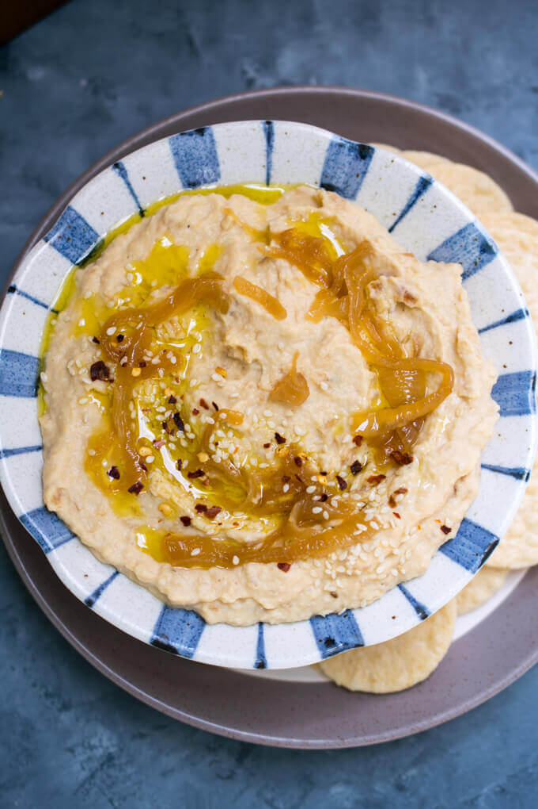
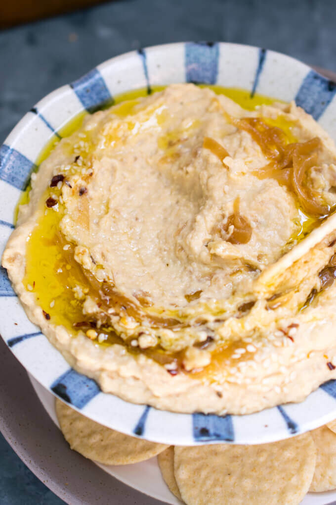
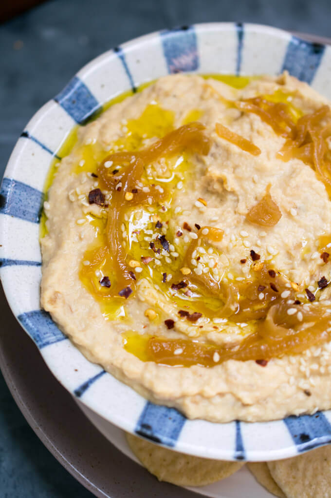

# Caramelized Onion Hummus

September 26, 2018 By [Shannon @ Yup, it's Vegan][0]

I cooked a big batch of chickpeas a couple of weeks ago and thought I'd try my hand at making a copycat of Cava's amazing caramelized onion hummus. The homemade version is nearly as good and makes a giant bowl of hummus instead of a tiny tub for $7 ;).

Store bought hummus is always pretty hit and miss for me. By no means am I draconian about these things, but I feel like I can taste the extra preservatives and natural flavors in a way that affects my eating experience. That is, unless I splurge on brands like **Cava**, **Hope** etc. The other type of hummus I seem to consistently enjoy is the kind served at Levantine restaurants.

It took me a long time to figure out why this preference is, but I think it really comes down to the quality and freshness of the tahini. The most delicious, rich, restaurant-style hummus is made with a boatload of tahini in it, and their tahini isn't the same one we're buying at the grocery store. It's made from fresh sesame seeds that are deeply roasted, bringing out their natural sweetness and imparting a little smoky flavor. Basically, it tastes good enough that I actually want to eat a dip that's mostly tahini.\*

(On the other hand, store bought hummus often gets its creaminess from cheap vegetable oil and then has other flavoring added back in, because it's cheaper to make it this way.)

Absent making my own tahini, something I haven't gotten around to yet, I'm content with introducing other hummus flavors and using a tahini and olive oil (or [aquafaba][4]) blend to make it creamy, so that it doesn't rely so heavily on a tahini that I don't really love.

In the case of this caramelized onion hummus, 3 whole onions are caramelized before blending them into the rest of the dip, and here I bothered (for once) to remove the skins from the chickpeas to make it ultra smooth. I added quite a lot of lemon juice and salt, a little bit of garlic, and just enough of my sad plebeian tahini that I feel like I can still call this hummus. It's all about seasoning to taste, though, so be ready to let your taste buds guide you!

Someday I'll crack the tahini code and you can be sure that you'll hear from me then; until then make one of my many wonderful hummus flavors here on the site, including caramelized onion hummus (below), [roasted red pepper white bean hummus][4], [roasted carrot ginger hummus][5], or [edamame hummus][6].

## Caramelized Onion Hummus

Creamy caramelized onion hummus, made with real caramelized onions, tahini, garlic, and lemon. Cheaper, tastier, and dare I say healthier than the store-bought kind!

Prep Time
: 15 minutes

Cook Time
: 35 minutes

Total Time
: 50 minutes

Total Yield
: 3 cups

Calories Per Serving
: 120 kcal

### Ingredients

* 2 tbsp [olive oil][7] divided, plus more for serving
* 3 large yellow or white onions thinly sliced
* 6 tbsp freshly-squeezed lemon juice
* 1/4 cup tahini
* 1 clove garlic finely chopped
* 3 cups cooked chickpeas (remove the skins if desired for a smoother texture)
* salt to taste (I start with 1 tsp if cooking my chickpeas from scratch, or 1/3 tsp if using canned chickpeas)

### Instructions

1. Add 1 tbsp of the olive oil to a large, wide skillet over medium heat. When hot, add the onion slices with a pinch of salt and stir well to break them up. Reduce the heat to medium-low so that you just barely hear the onions sizzling. Continue to cook, stirring only occasionally and keeping the onions spread out in the pan, until the onions have reduced significantly in size and darkened deeply (but not burned), about 30 minutes. Set aside.
2. Add the remaining 1 tbsp of olive oil, lemon juice, tahini and garlic to a food processor and blend until relatively smooth, scraping down the sides if needed. Add half of the cooked chickpeas and half of the caramelized onions, blending to combine. Reserve a few caramelized onions for topping and then add the rest of the onions and chickpeas to the food processor. Blend until smooth, and season to taste with salt and more lemon juice.
3. Serve topped with the remaining caramelized onions (you can chop them up if you like) and with an extra drizzle of oil, if desired. This caramelized onion hummus is tasty warm and fresh, but it's actually even better after a night in the fridge for the flavors to meld. Leftovers will keep in the fridge for 5-7 days.

#### Nutrition Facts

<!-- Neat Nutrition facts table in HTML, a keeper! -->

  

    
Nutrition Facts

    
Caramelized Onion Hummus

    

    
Amount Per Serving (0.25 cups)

    

      <strong>Calories</strong> 120
      Calories from Fat 45
    

    

    

      <strong>% Daily Value*</strong>
    

    

      <strong>Fat</strong> 5g<strong>8%</strong>
    

    

      Saturated Fat 1g<strong>6%</strong>
    

    

      Polyunsaturated Fat 1g
    

    

      Monounsaturated Fat 3g
    

    

      <strong>Carbohydrates</strong> 14g<strong>5%</strong>
    

    

      Fiber 1g<strong>4%</strong>
    

    

      Sugar 1g<strong>1%</strong>
    

    

      <strong>Protein</strong> 5g<strong>10%</strong>
    

    

      * Percent Daily Values are based on a 2000 calorie diet.
    

  

\*For the record, this all ties in to why hummus and vegetable sandwiches as the vegan option at restaurants are often so freakin' lame. If they used some legit, fresh tahini for their hummus, or made a flavor like caramelized onion hummus to liven things up, then I'd happily eat hummus and veggies on bread and I probably wouldn't even complain about it on HappyCow afterward.

[0]: https://yupitsvegan.com/author/shannonwp/
[2]: https://cava.com/products
[3]: https://hopefoods.com/products/
[4]: https://yupitsvegan.com/roasted-red-pepper-white-bean-hummus/
[5]: https://yupitsvegan.com/harvest-carrot-and-ginger-hummus/
[6]: https://yupitsvegan.com/edamame-hummus/
[7]: http://amzn.to/2G31XJb
